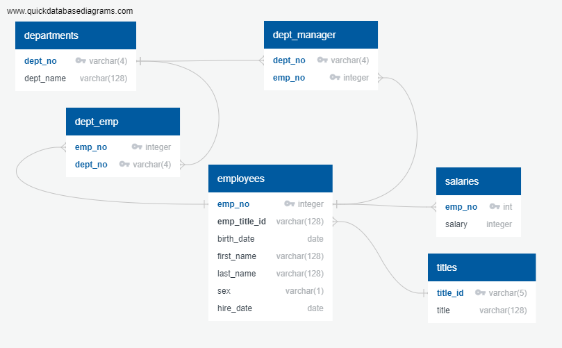
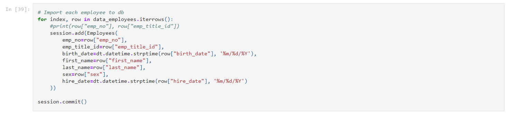
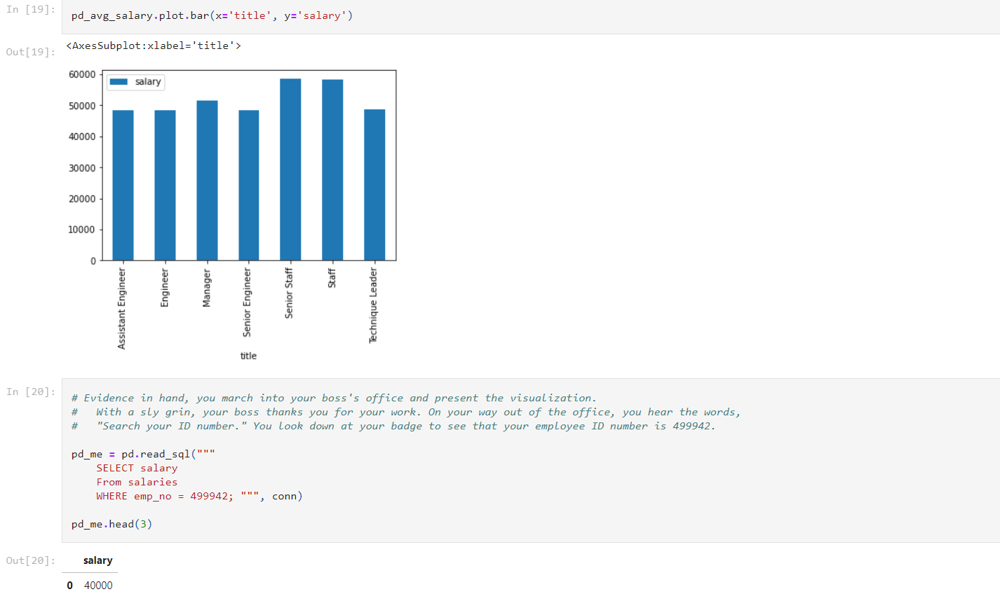

# Employee Database: Data Modeling, Data Engineering and Data Analysis

In this project 3 notebooks were created to figure out what posible relations exists between files to create the database where them will be loaded to finally consume the database to make the analysis.

#### [Data Modeling](https://github.com/kioz-developer/sql-challenge/blob/main/1.%20Data%20Modeling.ipynb).
First of all, needs to design the database after look into each file, [http://www.quickdatabasediagrams.com](http://www.quickdatabasediagrams.com) tool was used. [(notebook)](https://github.com/kioz-developer/sql-challenge/blob/main/1.%20Data%20Modeling.ipynb).

#### [Data Engineering](https://github.com/kioz-developer/sql-challenge/blob/main/2.%20Data%20Engineering.ipynb).

Import each CSV file into it corresponding SQL table using sqlalchemy. [(notebook)](https://github.com/kioz-developer/sql-challenge/blob/main/2.%20Data%20Engineering.ipynb)

#### [Data Analysis](https://github.com/kioz-developer/sql-challenge/blob/main/3.%20Data%20Analysis.ipynb).

Finally using sqlalchemy and pandas create some analysis with the data loaded into database created before. [(notebook)](https://github.com/kioz-developer/sql-challenge/blob/main/3.%20Data%20Analysis.ipynb)

